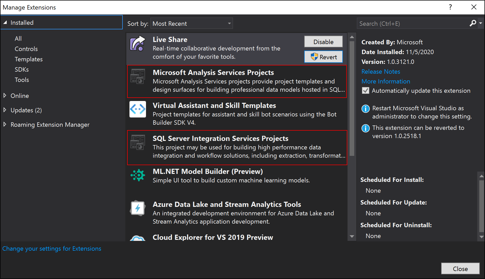
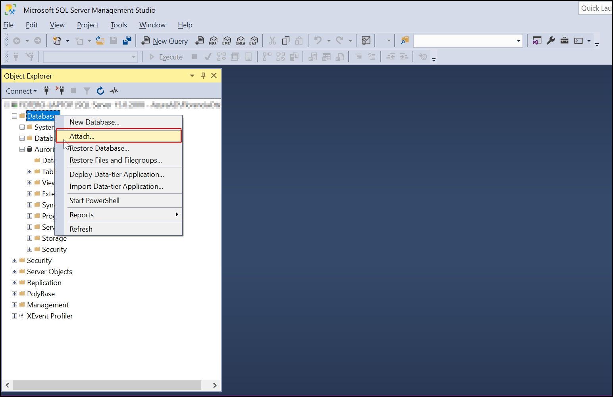

# Sistema de soporte a las decisiones - Guia de Uso e instalación

## Pre-requisitos
1. Visual Studio: [Descarga Visual Studio](https://visualstudio.microsoft.com/es/downloads/).
   1. Asegurese seleccionar Almacenamiento y procesamiento de datos y a la derecha solo seleccionan SQL Server Data Tools.
    
   3. Una vez instalado asegurese agregar las extensiones SQL Server Integration Services Projects y Microsoft Analysis Services Projects.
   
2. SQL Server Express: [link de descarga](https://www.microsoft.com/es-es/sql-server/sql-server-downloads)
   1. Instalar la versión express
   2. Durante la instalación dejar todo por default, excepto el tipo de autenticación:
         1. Usar Mixed Mode.
         2. Agregar una clave para acceso de SA.
3. SQL Management studio: [link de descarga](https://aka.ms/ssmsfullsetup)
4. Access: [descargar componente para Access](https://www.microsoft.com/es-ES/download/details.aspx?id=13255)

## Archivos necesarios
Para poder realizar el proceso, debe asegurarse de contar con los siguientes archivos:
1. Data sources: 
   1. [Neptuno Access Database](./data_sources/Neptuno%20v2020.mdb)
   2. [Presupuesto de ventas](./data_sources/Presupuesto%20de%20Ventas_v2020_Conciliado.xlsx)
2. Base de datos final
   1. [Aurorita_DW](./database/Aurorita_DW.mdf)

## Importar base de datos
Abrir Microsoft SQL Management studio y conectarse a su localhost
Una vez conectado, proceda a importar la base de datos [Aurorita_DW](./database/Aurorita_DW.mdf)

En Databases haga click derecho y seleccione _"Attach"_

En la nueva ventana, busque el botón _Add_ para seleccionar un nuevo archivo _mdf_.

Vamos a buscar y seleccionar nuestra base de datos [Aurorita_DW](./database/Aurorita_DW.mdf). Haremos click en _OK_ y luego nuevamente en _OK_ en la ventana que se abre. Luego nuestra base de datos estará importada.

## Cómo correr el proceso

### Abrir la solucion
- Desde el explorador de archivos o desde Visual Studio, localizar el archivo [SopAccess.sln](SopAccess.sln)
- Abrir la solucion en Visual Studio

### Apuntar a nuevos archivos de entrada y destino

Localizar la solapa Connection Managers para poder reemplazar los archivos de entrada y base de datos de destino para correr el proceso localmente

Hacer doble click en Administrador de conexiones con Excel y reemplazar por el directorio local donde tiene el archivo [Presupuesto de ventas](./data_sources/Presupuesto%20de%20Ventas_v2020_Conciliado.xlsx)

Luego, debe reemplazar la base de datos Access. Hacer doble click dónde se ve Neptuno v2020 y en el diálogo que se abre, reemplazar el directorio por su directorio local de [Neptuno Access Database](./data_sources/Neptuno%20v2020.mdb). Para finalizar, puede testear la conexión para asegurarse de que todo salió bien.

Finalmente, reemplazar la base de datos para apuntar a su base de datos local de Aurorita_DW. Nuevamente, puede testear su conexión.

Una vez realizados estos pasos, su ETL debería verse así:

## Correr el proceso ETL

En Visual Studio, seleccione Start y el proceso comenzará a correr

Primero se hará un build de la solución que tiene que ser exitoso para que el proceso comience:

El proceso comienza a correr y debería verse de la siguiente manera:

Finalmente, si el proceso es exitoso verá el siguiente output:

